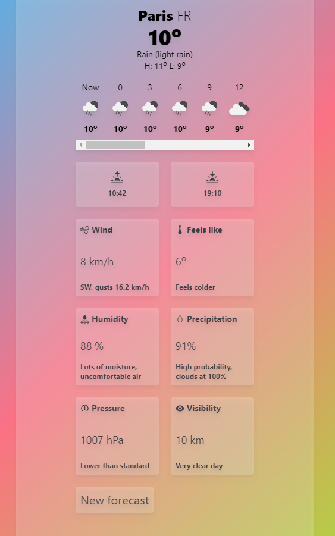

# Weather
This repository is using ReactJS, TypeScript and TailwindCSS. It also runs on node and has a formatter - prettier.

If for some reason you can't start the app, you can visit the already deployed app by following this link https://weather-amber-seven.vercel.app/
## How To Run
Run `npm i` to get all the required dependencies installed

After everything is installed, run `npm run dev` and navigate to http://localhost:5173

## API Calls
**Note: The OpenWeather API uses an API key.**  You need to create a .env file in the repository, where you need to write the value of your API key, in this case `VITE_API_KEY = {your_API_key}` (you can get it when you register on the OpenWeather API website).

## Preview
